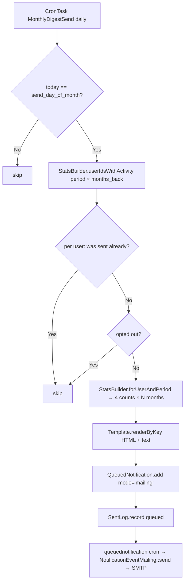

# 📅 Monthly Ticket Digest — GLPI Plugin

<p align="center">
  
  
  
  
</p>

<p align="center">
  <a href="#-english">English</a> • <a href="#-русский">Русский</a>
</p>

---

<h2 id="-english">🇬🇧 English</h2>

Personal monthly summary email to every active GLPI user — created / solved / closed / still open — for the previous calendar month (or last 2-3 months, configurable). Delivery goes through GLPI's `QueuedNotification` so SMTP, DKIM, retries and throttling are owned by core. Outlook 2021 LTSC-compatible HTML template with editable bodies from the admin UI.

### ✨ Features

| Feature | Description |
|---|---|
| 📊 **Per-user summary** | 4 counters: created / solved / closed / open |
| 📅 **Configurable schedule** | Day of month 1–28 (default 1) |
| 🔄 **Configurable period** | 1, 2 or 3 trailing months aggregated per digest |
| ✏️ **Editable email templates** | Edit HTML and plain-text bodies directly in the admin panel, with Twig syntax validation and "reset to default" |
| 📨 **Outlook-2021-LTSC safe** | Table-based layout, inline `<font>` tags, VML `<v:roundrect>` button, no gradients/border-radius/flexbox — renders identically in Word HTML engine |
| 🌍 **Localised** | Picks user's GLPI language (`en_GB`, `ru_RU` shipped) |
| 🔁 **Idempotent** | A user/period pair is sent only once even if cron runs again |
| 🚪 **Opt-out** | Tokenised unsubscribe link in every email |
| 🧪 **Test mode** | Redirects all outgoing mails to one admin address |
| 🖱️ **Preview + send-test** | Admin UI buttons + CLI `--dry-run` |
| 📋 **Send log** | Persisted history (who / when / status / errors) |
| 🛠️ **CLI** | `php bin/console monthlydigest:send --period=YYYY-MM --force` |

### 📋 Requirements

| Requirement | Version |
|---|---|
| GLPI | `>= 11.0.0` and `< 11.1` (tested on 11.0.7) |
| PHP | `>= 8.2` |
| Database | MySQL 8.0+ / MariaDB 10.5+ |

### 🚀 Installation

1. Extract `monthlydigest` into `<glpi>/plugins/` or `<glpi>/marketplace/`
2. **Setup → Plugins → Install → Enable**
3. **Setup → Plugins → Monthly Digest → Configure** (the cog icon) — open the standalone settings page
4. Toggle **Enabled** and pick the send day + digest period
5. Make sure the `queuednotification` cron is running (it is, by default)

> **Note:** The settings page is a standalone plugin page, NOT a tab inside Setup → Config. This is intentional — GLPI 11.0.7's `base_form.html.twig` wraps Config tabs in an outer `<form>`, which would break the plugin's CSRF flow on save.

### ⚙️ Configuration

All settings live on one page (`Plugins → Monthly Digest → Configure`):

| Option | Default | Range | What it does |
|---|---|---|---|
| `enabled` | `0` | 0/1 | Master kill-switch |
| `send_day_of_month` | `1` | 1..28 | Day of month to dispatch (28 = February-safe) |
| `period_months` | `1` | 1, 2, 3 | How many trailing months are summed in each digest |
| `subject_template` | `""` | text | Optional, `%s` becomes the period label (e.g. "Your tickets — %s") |
| `include_zero_users` | `0` | 0/1 | Also email users with no tickets in period |
| `test_mode` | `0` | 0/1 | Force ALL outgoing mail to `test_recipient` (production-safe) |
| `test_recipient` | `""` | email | Used when `test_mode = 1` |

### ✏️ Editing email templates

The settings page has an **Email templates** card with two rows: HTML body and Plain-text body. Each has:

- **Edit** button → opens a dedicated editor page with a large textarea
- **Live status badge**: `Customised` (DB override) or `Default (file)` (shipped)
- **Available variables table** at the bottom of the editor — lists every Twig variable you can use (`{{ user.name }}`, `{{ stats.created }}`, `{{ period_label }}`, `{{ glpi_url }}`, `{{ unsubscribe_url }}` etc.) with descriptions
- **Save** → Twig syntax is validated on the server before persisting; errors are shown inline
- **Preview** → renders the template with sample data in a new tab
- **Reset to default** → wipes the DB row, restores the file-shipped default

Customised bodies are stored in `glpi_plugin_monthlydigest_templates` and override the shipped `templates/digest_html.twig` / `templates/digest_text.twig` files.

### 🖥️ CLI

```bash
# Send the digest for the previous month to all eligible users
php bin/console monthlydigest:send

# Dry-run: show who would receive what
php bin/console monthlydigest:send --dry-run

# Specific period or user, ignoring day-of-month / idempotency
php bin/console monthlydigest:send --period=2026-04 --user=42 --force
```

The CLI honours the `period_months` config — if set to 3, `--period=2026-04` aggregates April–June 2026.

### 🔧 How it works



### 📁 File structure

```
monthlydigest/
├── front/
│   ├── config.form.php       # Standalone settings page (entry via $PLUGIN_HOOKS['config_page'])
│   ├── config.update.php     # POST → setConfigurationValues + redirect back
│   ├── preview.php           # Admin preview for any user/period
│   ├── sendnow.php           # Legacy backward-compat stub (stateless redirect)
│   ├── unsubscribe.php       # Public opt-out via token (HMAC-signed)
│   ├── template.form.php     # 📝 Editor for one email template
│   ├── template.update.php   # POST → validate Twig → save body to DB
│   └── template.reset.php    # GET → wipe DB row, fall back to file
├── inc/
│   ├── installer.class.php           # DB schema (3 tables) + cron registration
│   ├── statsbuilder.class.php        # 4 counters per user × N-month window
│   ├── userpref.class.php            # Opt-out + HMAC tokens
│   ├── sentlog.class.php             # Idempotency log
│   ├── digestsender.class.php        # Render via Template service + queue
│   ├── template.class.php            # 📝 Custom template storage (DB+file fallback, Twig render+validate)
│   ├── crontask.class.php            # Daily trigger
│   ├── sendcommand.class.php         # bin/console monthlydigest:send
│   └── config.class.php              # Settings page renderer
├── templates/                        # Shipped Twig templates (defaults)
│   ├── config.html.twig              # Admin settings + email-templates card
│   ├── digest_html.twig              # Outlook-LTSC-safe email body (default)
│   ├── digest_text.twig              # Plain-text alternative (default)
│   └── template_edit.html.twig       # Editor UI
└── locales/
    ├── en_GB.po / .mo
    ├── ru_RU.po / .mo
    └── _compile_mo.py                # Helper for compiling PO → MO without msgfmt
```

### 🗄️ Database tables

| Table | Purpose |
|---|---|
| `glpi_plugin_monthlydigest_sent_log` | Idempotency log: `(users_id, period) → status, recipient, error` |
| `glpi_plugin_monthlydigest_userpref` | Per-user opt-out + HMAC unsubscribe token |
| `glpi_plugin_monthlydigest_templates` | Customised template bodies overriding the shipped Twig files |

All three are kept on uninstall (preserves history); drop manually if a clean wipe is desired.

### 📨 Email template — Outlook 2021 LTSC compatibility

The shipped HTML template uses the bulletproof email patterns required by Word's HTML rendering engine (used by Outlook 2021 LTSC). It includes:

- VML namespaces (`xmlns:v`, `xmlns:o`) and MSO conditional `<o:OfficeDocumentSettings>` (96 DPI)
- VML `<v:roundrect>` button with `<w:anchorlock/>` for full-area clicks, plus a fallback `<a>` for non-Outlook clients
- `<table>` + `bgcolor=` attribute for layout (no flexbox, no gradients, no `border-radius`)
- `<font face=... color=...>` for text (Word defaults to Times New Roman otherwise)
- Spacer cells for inter-card gaps (no `border-spacing`)
- Soft pastel palette (blue-500, green-600, violet-600, amber-600)

If you customise the HTML body via the admin editor, keep these patterns intact for Outlook to render correctly.

---

<h2 id="-русский">🇷🇺 Русский</h2>

Ежемесячное персональное письмо-сводка каждому активному пользователю GLPI: создано / решено / закрыто / открыто за прошлый календарный месяц (или последние 2-3 месяца — настраивается). Доставка через `QueuedNotification` GLPI — SMTP, DKIM, повторы и throttling делает ядро. HTML-шаблон письма совместим с Outlook 2021 LTSC, тела писем редактируются из админ-панели.

### ✨ Возможности

| Функция | Описание |
|---|---|
| 📊 **Персональная сводка** | 4 счётчика: создано / решено / закрыто / открыто |
| 📅 **Настраиваемое расписание** | День месяца 1–28 (по умолчанию 1) |
| 🔄 **Настраиваемый период** | 1, 2 или 3 прошедших месяца суммируются в одном письме |
| ✏️ **Редактирование шаблонов писем** | Редактирование HTML и plain-text тел прямо в админке с Twig-валидацией и сбросом на дефолт |
| 📨 **Outlook 2021 LTSC совместимо** | Table-based раскладка, inline `<font>`, VML `<v:roundrect>` кнопка, никаких градиентов/border-radius/flexbox — рендерится корректно в Word HTML engine |
| 🌍 **Локализация** | Язык из профиля пользователя (`ru_RU`, `en_GB` в комплекте) |
| 🔁 **Идемпотентность** | Одной паре (user, период) — одно письмо, даже если cron перезапустится |
| 🚪 **Отписка** | Токенизированная ссылка в каждом письме |
| 🧪 **Тестовый режим** | Перенаправляет все письма на один админский адрес |
| 🖱️ **Превью + тест-отправка** | Кнопки в админке + CLI с `--dry-run` |
| 📋 **Журнал отправок** | История: кому, когда, статус, ошибки |
| 🛠️ **CLI** | `php bin/console monthlydigest:send --period=ГГГГ-ММ --force` |

### 📋 Требования

GLPI `>= 11.0.0` и `< 11.1` (проверено на 11.0.7) · PHP `>= 8.2` · MySQL 8.0+ / MariaDB 10.5+

### 🚀 Установка

1. Распаковать папку `monthlydigest` в `<glpi>/plugins/` или `<glpi>/marketplace/`
2. **Настройка → Плагины → Установить → Включить**
3. **Настройка → Плагины → Monthly Digest → Configure** (шестерёнка) — открывается отдельная страница настроек плагина
4. Включить плагин (Enabled = Да) и выбрать день месяца + период дайджеста
5. Убедиться что cron `queuednotification` работает (по умолчанию работает)

> **Заметка:** Страница настроек — это **отдельная страница плагина**, а не таб внутри Setup → Config. Это сделано осознанно — в GLPI 11.0.7 `base_form.html.twig` оборачивает Config-табы во внешнюю `<form>`, что ломает CSRF-flow плагина на сохранении.

### ⚙️ Настройки

Все опции на одной странице (`Плагины → Monthly Digest → Configure`):

| Опция | По умолчанию | Диапазон | Что делает |
|---|---|---|---|
| `enabled` | `0` | 0/1 | Главный переключатель |
| `send_day_of_month` | `1` | 1..28 | День месяца для рассылки (28 = безопасно для февраля) |
| `period_months` | `1` | 1, 2, 3 | Сколько прошедших месяцев суммируется в одном письме |
| `subject_template` | `""` | текст | Опционально, `%s` подставит подпись периода (напр. «Ваши заявки — %s») |
| `include_zero_users` | `0` | 0/1 | Отправлять также пользователям без активности за период |
| `test_mode` | `0` | 0/1 | Перенаправить ВСЕ исходящие письма на `test_recipient` (безопасно для прода) |
| `test_recipient` | `""` | email | Используется при `test_mode = 1` |

### ✏️ Редактирование шаблонов писем

На странице настроек есть карточка **«Шаблоны писем»** с двумя строками: HTML-тело и Plain-text тело. Для каждого:

- Кнопка **Редактировать** → отдельная страница редактора с большой textarea
- **Бейдж статуса**: `Изменён` (есть запись в БД) или `Дефолт (из файла)` (читается файл из поставки)
- **Таблица доступных переменных** под редактором — все Twig-переменные (`{{ user.name }}`, `{{ stats.created }}`, `{{ period_label }}`, `{{ glpi_url }}`, `{{ unsubscribe_url }}` и т.д.) с описаниями
- **Сохранить** → синтаксис Twig валидируется на сервере перед записью; ошибки показываются inline
- **Превью** → рендерит шаблон с тестовыми данными в новой вкладке
- **Сбросить на дефолт** → удаляет запись из БД, возвращает чтение из файла

Кастомизированные тела хранятся в `glpi_plugin_monthlydigest_templates` и переопределяют поставочные файлы `templates/digest_html.twig` / `templates/digest_text.twig`.

### 🖥️ CLI

```bash
# Отправить дайджест за прошлый месяц всем
php bin/console monthlydigest:send

# Сухой прогон: посмотреть кому отправилось бы
php bin/console monthlydigest:send --dry-run

# Конкретный период или пользователь, игнорируя day-of-month / идемпотентность
php bin/console monthlydigest:send --period=2026-04 --user=42 --force
```

CLI учитывает `period_months` — если стоит 3, `--period=2026-04` агрегирует апрель–июнь 2026.

### 🗄️ Таблицы БД

| Таблица | Назначение |
|---|---|
| `glpi_plugin_monthlydigest_sent_log` | Журнал идемпотентности: `(users_id, period) → status, recipient, error` |
| `glpi_plugin_monthlydigest_userpref` | Per-user opt-out + HMAC-токен для отписки |
| `glpi_plugin_monthlydigest_templates` | Кастомизированные тела шаблонов (переопределяют файлы из поставки) |

Все три таблицы **не удаляются** при uninstall (сохраняется история); удаляй вручную если нужен чистый wipe.

### 🌐 Перевод

`.po` файлы в `locales/`. Чтобы пересобрать `.mo` без установленного `msgfmt`:

```powershell
python locales/_compile_mo.py locales/ru_RU.po locales/ru_RU.mo
python locales/_compile_mo.py locales/en_GB.po locales/en_GB.mo
```

### 📨 Совместимость email-шаблона с Outlook 2021 LTSC

Поставочный HTML-шаблон использует bulletproof email-паттерны, требуемые движком Word (используется в Outlook 2021 LTSC):

- VML namespaces (`xmlns:v`, `xmlns:o`) и MSO условие `<o:OfficeDocumentSettings>` (96 DPI)
- VML `<v:roundrect>` кнопка с `<w:anchorlock/>` для кликабельности всей площади, плюс fallback `<a>` для остальных клиентов
- `<table>` + `bgcolor=` атрибут для раскладки (никакого flexbox, градиентов, `border-radius`)
- `<font face=... color=...>` для текста (иначе Word подставляет Times New Roman)
- Spacer-ячейки для зазоров между карточками (вместо `border-spacing`)
- Мягкая пастельная палитра (blue-500, green-600, violet-600, amber-600)

Если кастомизируешь HTML-тело через редактор в админке — сохрани эти паттерны, иначе Outlook сломает рендер.

---

## 🩹 Troubleshooting

### Settings don't save / CSRF error on POST

If you see `AccessDeniedHttpException` from `CheckCsrfListener.php`:

1. Verify the form's hidden `_glpi_csrf_token` field is **not empty** (DevTools → Elements → Form inputs)
2. If it's empty, the Twig `csrf_token()` function is silently returning empty in plugin context — this plugin works around it by generating the token in PHP via `Session::getNewCSRFToken()` and passing it as a variable. Make sure you're on v1.0.5+
3. Clear GLPI's Twig cache: `rm -rf /var/glpi/files/_cache/twig/*`

### Email looks broken in Outlook

If the email looks fine in the in-GLPI preview but broken in Outlook:

1. Confirm Outlook is **2021 LTSC** (Word engine) — newer Outlook 365 uses webview
2. Verify the deployed template file matches v1.0.9 (no `linear-gradient`, no `border-radius:8px`):
   ```bash
   grep -c 'linear-gradient' /var/glpi/marketplace/monthlydigest/templates/digest_html.twig
   # Should print 0
   grep -c 'v:roundrect' /var/glpi/marketplace/monthlydigest/templates/digest_html.twig
   # Should print > 0
   ```
3. Clear Twig cache and re-run **Send test digest** to enqueue a fresh notification

### Plugin folder seemingly doesn't update on file replacement

GLPI Marketplace may keep an older version in `/var/glpi/files/_plugins/`. To force a clean state:

```bash
# 1. Deinstall in GLPI UI first
# 2. Then on the server:
rm -rf /var/glpi/marketplace/monthlydigest
rm -rf /var/glpi/files/_cache/twig/*
tar -xzf monthlydigest-1.0.9.tar.gz -C /var/glpi/marketplace/
# 3. Install + Enable in GLPI UI
```

---

## 📄 License / Лицензия

GNU General Public License v2.0 or later (**GPL-2.0+**).
