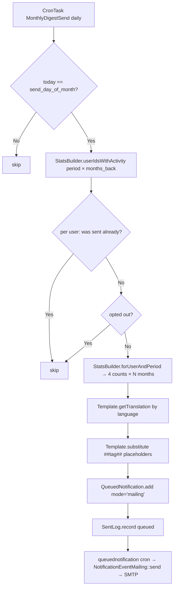

# 📅 Monthly Ticket Digest — GLPI Plugin

<p align="center">
  
  
  
  
</p>

<p align="center">
  <a href="#-english">English</a> • <a href="#-русский">Русский</a>
</p>

---

<h2 id="-english">🇬🇧 English</h2>

Personal monthly summary email to every active GLPI user — created / solved / closed / still open — for the previous calendar month (or last 2-3 months, configurable). Delivery goes through GLPI's `QueuedNotification` so SMTP, DKIM, retries and throttling are owned by core. Outlook 2021 LTSC-compatible HTML.

**Since v1.1.0** the subject + HTML/text bodies live in GLPI's native `NotificationTemplate` infrastructure — admins edit them in **Setup → Notifications → Notification templates → "Monthly Ticket Digest"** like any other GLPI notification.

### ✨ Features

| Feature | Description |
|---|---|
| 📊 **Per-user summary** | 4 counters: created / solved / closed / open |
| 📅 **Configurable schedule** | Day of month 1–28 (default 1) |
| 🔄 **Configurable period** | 1, 2 or 3 trailing months aggregated per digest |
| ✏️ **Native GLPI templates** | Subject + HTML + plain-text edited via Setup → Notifications, one translation row per language |
| 📨 **Outlook-2021-LTSC safe** | Table-based layout, inline `<font>` tags, VML `<v:roundrect>` button, no gradients/border-radius/flexbox — renders identically in Word HTML engine |
| 🌍 **Localised** | Picks user's GLPI language (`en_GB`, `ru_RU` shipped) |
| 🔁 **Idempotent** | A user/period pair is sent only once even if cron runs again |
| 🚪 **Opt-out** | Tokenised unsubscribe link in every email |
| 🧪 **Test mode** | Redirects all outgoing mails to one admin address |
| 🖱️ **Preview + send-test** | Admin UI buttons + CLI `--dry-run` |
| 📋 **Send log** | Persisted history (who / when / status / errors) |
| 🛠️ **CLI** | `php bin/console plugins:monthlydigest:send --period=YYYY-MM --force` |

### 📋 Requirements

| Requirement | Version |
|---|---|
| GLPI | `>= 11.0.0` and `< 11.1` (tested on 11.0.7) |
| PHP | `>= 8.2` |
| Database | MySQL 8.0+ / MariaDB 10.5+ |

### 🚀 Installation

1. Extract `monthlydigest` into `<glpi>/plugins/` or `<glpi>/marketplace/`
2. **Setup → Plugins → Install → Enable** — this creates:
   - 2 plugin-owned tables (`sent_log`, `userpref`)
   - 1 daily CronTask
   - 1 row in `glpi_notificationtemplates` (the editable template)
   - 3 rows in `glpi_notificationtemplatetranslations` (default / en_GB / ru_RU)
   - 1 row in `glpi_notifications` + 1 link row binding the event to the template
3. **Setup → Plugins → Monthly Digest → Configure** (the cog icon) — toggle **Enabled**, pick the send day and digest period
4. Make sure the `queuednotification` cron is running (it is, by default)

> **Note:** The settings page is a standalone plugin page, NOT a tab inside Setup → Config. This is intentional — GLPI 11.0.7's `base_form.html.twig` wraps Config tabs in an outer `<form>`, which would break the plugin's CSRF flow on save. The **email content** lives in GLPI's standard notification UI for native editing.

> **Upgrading from 1.0.x:** disable the plugin, **uninstall**, replace the files, then install + enable again. The legacy `glpi_plugin_monthlydigest_templates` table (1.0.9 plugin-owned editor) is dropped on install — any custom Twig template bodies you had there must be re-applied via the new GLPI notification UI (with `##tag##` syntax instead of Twig).

### ⚙️ Configuration

All settings live on one page (`Plugins → Monthly Digest → Configure`):

| Option | Default | Range | What it does |
|---|---|---|---|
| `enabled` | `0` | 0/1 | Master kill-switch |
| `send_day_of_month` | `1` | 1..28 | Day of month to dispatch (28 = February-safe) |
| `period_months` | `1` | 1, 2, 3 | How many trailing months are summed in each digest |
| `subject_template` | `""` | text | Optional override of the NotificationTemplate subject (`%s` = period label). Empty = use the subject from Setup → Notifications |
| `include_zero_users` | `0` | 0/1 | Also email users with no tickets in period |
| `test_mode` | `0` | 0/1 | Force ALL outgoing mail to `test_recipient` (production-safe) |
| `test_recipient` | `""` | email | Used when `test_mode = 1` |

### ✏️ Editing the email content

The settings page has an **Email templates** card showing the install status, plus two buttons that deep-link into GLPI's standard notification UI:

- **Edit notification template** → `/front/notificationtemplate.form.php?id=N` — change subject + HTML body + plain-text body per language
- **Edit Notification binding** → `/front/notification.form.php?id=N` — change recipients, mode, active state

Inside the template editor:

- **Subject** field — supports `##tag##` placeholders (see below)
- **HTML body** field — plain textarea (no WYSIWYG), so the Outlook-LTSC patterns survive untouched
- **Plain-text body** field — same
- **Language** dropdown — select the translation you want to edit (default `''` = fallback)

#### Available `##tag##` placeholders

| Tag | Description |
|---|---|
| `##user.id##` | Recipient user id |
| `##user.name##` | Display name (firstname + realname or login) |
| `##user.firstname##` | First name |
| `##user.realname##` | Surname |
| `##period_label##` | Localised period label (e.g. "April 2026" / "Mar–Apr 2026") |
| `##stats.created##` | Tickets created in period |
| `##stats.solved##` | Tickets solved in period |
| `##stats.closed##` | Tickets closed in period |
| `##stats.open##` | Tickets still open at period end |
| `##stats.period##` | YYYY-MM key of period start month |
| `##stats.months_back##` | Window size (1, 2 or 3 months) |
| `##glpi_url##` | Configured base URL of the GLPI instance |
| `##cta_url##` | `glpi_url + /front/ticket.php` (the "My tickets" deep link) |
| `##unsubscribe_url##` | Tokenised opt-out URL for the recipient |
| `##lang##` | User's GLPI language code, short form (`ru`, `en`, ...) |
| `##locale##` | User's full GLPI language code (`ru_RU`, `en_GB`, ...) |

Empty body = the plugin falls back to its shipped seed (`templates/seed/digest_html_*.html`).

### 🖥️ CLI

```bash
# Send the digest for the previous month to all eligible users
php bin/console plugins:monthlydigest:send

# Dry-run: show who would receive what
php bin/console plugins:monthlydigest:send --dry-run

# Specific period or user, ignoring day-of-month / idempotency
php bin/console plugins:monthlydigest:send --period=2026-04 --user=42 --force
```

The CLI honours the `period_months` config — if set to 3, `--period=2026-04` aggregates April–June 2026.

### 🔧 How it works



### 📁 File structure

```
monthlydigest/
├── front/
│   ├── config.form.php       # Standalone settings page (entry via $PLUGIN_HOOKS['config_page'])
│   ├── config.update.php     # POST → setConfigurationValues + redirect back
│   ├── preview.php           # Admin preview for any user/period
│   ├── sendnow.php           # Legacy backward-compat stub (stateless redirect)
│   └── unsubscribe.php       # Public opt-out via token (HMAC-signed)
├── inc/
│   ├── installer.class.php          # Schema + NotificationTemplate + Notification seeding + cron
│   ├── statsbuilder.class.php       # 4 counters per user × N-month window
│   ├── userpref.class.php           # Opt-out + HMAC tokens
│   ├── sentlog.class.php            # Idempotency log
│   ├── digestsender.class.php       # Reads NotificationTemplateTranslation, substitutes ##tag##, queues
│   ├── template.class.php           # 📝 Adapter onto GLPI's native NotificationTemplate (lookup, substitute, edit URLs)
│   ├── crontask.class.php           # Daily trigger
│   ├── sendcommand.class.php        # bin/console plugins:monthlydigest:send
│   └── config.class.php             # Settings page renderer
├── templates/                        # Runtime Twig templates (admin UI only)
│   └── config.html.twig             # Admin settings + tag reference + link to GLPI Notifications
├── templates/seed/                   # Install-time seeds for NotificationTemplateTranslation rows
│   ├── digest_html_en.html
│   ├── digest_text_en.txt
│   ├── digest_html_ru.html
│   └── digest_text_ru.txt
└── locales/
    ├── en_GB.po / .mo
    ├── ru_RU.po / .mo
    └── _compile_mo.py                # Helper for compiling PO → MO without msgfmt
```

### 🗄️ Database tables

**Plugin-owned (kept on uninstall — preserves history):**

| Table | Purpose |
|---|---|
| `glpi_plugin_monthlydigest_sent_log` | Idempotency log: `(users_id, period) → status, recipient, error` |
| `glpi_plugin_monthlydigest_userpref` | Per-user opt-out + HMAC unsubscribe token |

**GLPI-native (seeded on install, removed on uninstall):**

| Table | Rows |
|---|---|
| `glpi_notificationtemplates` | 1 row (`name = "Monthly Ticket Digest"`, `itemtype = "User"`) |
| `glpi_notificationtemplatetranslations` | 3 rows (default `''`, `en_GB`, `ru_RU`) |
| `glpi_notifications` | 1 row (`event = "monthly_digest"`, `mode = "mailing"`) |
| `glpi_notifications_notificationtemplates` | 1 link row |

The legacy `glpi_plugin_monthlydigest_templates` table from v1.0.9 is **dropped** when the v1.1.0 installer runs. Any custom Twig template bodies stored there are lost — re-apply them via the GLPI notification UI using `##tag##` syntax.

### 📨 Email template — Outlook 2021 LTSC compatibility

The shipped HTML template uses the bulletproof email patterns required by Word's HTML rendering engine (used by Outlook 2021 LTSC). It includes:

- VML namespaces (`xmlns:v`, `xmlns:o`) and MSO conditional `<o:OfficeDocumentSettings>` (96 DPI)
- VML `<v:roundrect>` button with `<w:anchorlock/>` for full-area clicks, plus a fallback `<a>` for non-Outlook clients
- `<table>` + `bgcolor=` attribute for layout (no flexbox, no gradients, no `border-radius`)
- `<font face=... color=...>` for text (Word defaults to Times New Roman otherwise)
- Spacer cells for inter-card gaps (no `border-spacing`)
- Soft pastel palette (blue-500, green-600, violet-600, amber-600)

GLPI's `NotificationTemplateTranslation` form uses a plain `<textarea>` for `content_html` (NOT TinyMCE/WYSIWYG), so these patterns survive editing untouched. If you customise the HTML body, keep them intact for Outlook to render correctly.

---

<h2 id="-русский">🇷🇺 Русский</h2>

Ежемесячное персональное письмо-сводка каждому активному пользователю GLPI: создано / решено / закрыто / открыто за прошлый календарный месяц (или последние 2-3 месяца — настраивается). Доставка через `QueuedNotification` GLPI — SMTP, DKIM, повторы и throttling делает ядро. HTML-шаблон письма совместим с Outlook 2021 LTSC.

**Начиная с v1.1.0** тема + HTML/text-тела хранятся в штатной инфраструктуре `NotificationTemplate` GLPI — админ редактирует их в **Настройка → Уведомления → Шаблоны уведомлений → «Monthly Ticket Digest»** как любое другое уведомление GLPI.

### ✨ Возможности

| Функция | Описание |
|---|---|
| 📊 **Персональная сводка** | 4 счётчика: создано / решено / закрыто / открыто |
| 📅 **Настраиваемое расписание** | День месяца 1–28 (по умолчанию 1) |
| 🔄 **Настраиваемый период** | 1, 2 или 3 прошедших месяца суммируются в одном письме |
| ✏️ **Нативные шаблоны GLPI** | Тема + HTML + plain-text редактируются через Настройка → Уведомления, по одной записи перевода на язык |
| 📨 **Outlook 2021 LTSC совместимо** | Table-based раскладка, inline `<font>`, VML `<v:roundrect>` кнопка, никаких градиентов/border-radius/flexbox — корректный рендер в Word HTML engine |
| 🌍 **Локализация** | Язык из профиля пользователя (`ru_RU`, `en_GB` в комплекте) |
| 🔁 **Идемпотентность** | Одной паре (user, период) — одно письмо, даже если cron перезапустится |
| 🚪 **Отписка** | Токенизированная ссылка в каждом письме |
| 🧪 **Тестовый режим** | Перенаправляет все письма на один админский адрес |
| 🖱️ **Превью + тест-отправка** | Кнопки в админке + CLI с `--dry-run` |
| 📋 **Журнал отправок** | История: кому, когда, статус, ошибки |
| 🛠️ **CLI** | `php bin/console plugins:monthlydigest:send --period=ГГГГ-ММ --force` |

### 📋 Требования

GLPI `>= 11.0.0` и `< 11.1` (проверено на 11.0.7) · PHP `>= 8.2` · MySQL 8.0+ / MariaDB 10.5+

### 🚀 Установка

1. Распаковать папку `monthlydigest` в `<glpi>/plugins/` или `<glpi>/marketplace/`
2. **Настройка → Плагины → Установить → Включить** — установщик создаёт:
   - 2 plugin-owned таблицы (`sent_log`, `userpref`)
   - 1 ежедневный CronTask
   - 1 запись в `glpi_notificationtemplates` (редактируемый шаблон)
   - 3 записи в `glpi_notificationtemplatetranslations` (default / en_GB / ru_RU)
   - 1 запись в `glpi_notifications` + 1 линк-запись с шаблоном
3. **Настройка → Плагины → Monthly Digest → Configure** (шестерёнка) — включить и выбрать день месяца + период
4. Убедиться что cron `queuednotification` работает (по умолчанию работает)

> **Заметка:** Страница настроек — это отдельная страница плагина, не таб в Setup → Config. Это сделано осознанно: в GLPI 11.0.7 `base_form.html.twig` оборачивает Config-табы во внешнюю `<form>` что ломает CSRF flow плагина. **Содержимое писем** — в штатном NotificationTemplate UI для нативного редактирования.

> **Апгрейд с 1.0.x:** выключить плагин, **деинсталлировать**, заменить файлы, потом установить + включить снова. Старая таблица `glpi_plugin_monthlydigest_templates` (1.0.9 plugin-owned editor) при установке 1.1.0 удаляется — любые кастомные Twig-тела нужно перенести в новый GLPI notification UI с синтаксисом `##tag##` вместо Twig.

### ⚙️ Настройки

| Опция | По умолчанию | Диапазон | Что делает |
|---|---|---|---|
| `enabled` | `0` | 0/1 | Главный переключатель |
| `send_day_of_month` | `1` | 1..28 | День месяца для рассылки (28 = безопасно для февраля) |
| `period_months` | `1` | 1, 2, 3 | Сколько прошедших месяцев суммируется в одном письме |
| `subject_template` | `""` | текст | Опциональное переопределение темы NotificationTemplate (`%s` = подпись периода). Пусто = брать тему из Настройка → Уведомления |
| `include_zero_users` | `0` | 0/1 | Отправлять также пользователям без активности |
| `test_mode` | `0` | 0/1 | Перенаправить ВСЕ исходящие письма на `test_recipient` (безопасно для прода) |
| `test_recipient` | `""` | email | Используется при `test_mode = 1` |

### ✏️ Редактирование содержимого писем

На странице настроек есть карточка **«Шаблоны писем»** со статусом установки и двумя кнопками-ссылками в штатный GLPI:

- **Редактировать шаблон уведомления** → `/front/notificationtemplate.form.php?id=N` — менять тему + HTML- и text-тело на каждый язык
- **Редактировать привязку Notification** → `/front/notification.form.php?id=N` — менять получателей, режим, активность

Внутри редактора шаблона:

- **Subject** — поддерживает `##tag##` плейсхолдеры (см. ниже)
- **HTML body** — обычный textarea (без WYSIWYG), так что Outlook-LTSC паттерны не искажаются
- **Plain-text body** — то же самое
- **Language** dropdown — выбрать перевод для редактирования (default `''` = fallback)

#### Доступные `##tag##` плейсхолдеры

| Тег | Описание |
|---|---|
| `##user.id##` | ID пользователя-получателя |
| `##user.name##` | Отображаемое имя (firstname + realname или логин) |
| `##user.firstname##` | Имя |
| `##user.realname##` | Фамилия |
| `##period_label##` | Локализованная подпись периода («апрель 2026» / «мар-апр 2026») |
| `##stats.created##` | Заявок создано за период |
| `##stats.solved##` | Заявок решено за период |
| `##stats.closed##` | Заявок закрыто за период |
| `##stats.open##` | Заявок ещё открытых на конец периода |
| `##stats.period##` | YYYY-MM ключ первого месяца окна |
| `##stats.months_back##` | Размер окна (1, 2 или 3 месяца) |
| `##glpi_url##` | Настроенный базовый URL GLPI-инстанса |
| `##cta_url##` | `glpi_url + /front/ticket.php` (прямая ссылка на «Мои заявки») |
| `##unsubscribe_url##` | Уникальный URL отписки для получателя |
| `##lang##` | Краткий код языка (`ru`, `en`, ...) |
| `##locale##` | Полный языковой код (`ru_RU`, `en_GB`, ...) |

Пустое тело = плагин подставляет дефолт из `templates/seed/digest_html_*.html`.

### 🖥️ CLI

```bash
# Отправить дайджест за прошлый месяц всем
php bin/console plugins:monthlydigest:send

# Сухой прогон: посмотреть кому отправилось бы
php bin/console plugins:monthlydigest:send --dry-run

# Конкретный период или пользователь, игнорируя day-of-month / идемпотентность
php bin/console plugins:monthlydigest:send --period=2026-04 --user=42 --force
```

CLI учитывает `period_months` — если стоит 3, `--period=2026-04` агрегирует апрель–июнь 2026.

### 🗄️ Таблицы БД

**Plugin-owned (сохраняются при uninstall — история):**

| Таблица | Назначение |
|---|---|
| `glpi_plugin_monthlydigest_sent_log` | Журнал идемпотентности: `(users_id, period) → status, recipient, error` |
| `glpi_plugin_monthlydigest_userpref` | Per-user opt-out + HMAC-токен для отписки |

**GLPI-native (создаются на install, удаляются на uninstall):**

| Таблица | Записи |
|---|---|
| `glpi_notificationtemplates` | 1 запись (`name = "Monthly Ticket Digest"`, `itemtype = "User"`) |
| `glpi_notificationtemplatetranslations` | 3 записи (default `''`, `en_GB`, `ru_RU`) |
| `glpi_notifications` | 1 запись (`event = "monthly_digest"`, `mode = "mailing"`) |
| `glpi_notifications_notificationtemplates` | 1 линк-запись |

Старая таблица `glpi_plugin_monthlydigest_templates` из v1.0.9 при установке 1.1.0 **удаляется**. Кастомные Twig-тела из неё пропадут — перенеси их в GLPI notification UI с синтаксисом `##tag##`.

### 🌐 Перевод

`.po` файлы в `locales/`. Чтобы пересобрать `.mo` без установленного `msgfmt`:

```powershell
python locales/_compile_mo.py locales/ru_RU.po locales/ru_RU.mo
python locales/_compile_mo.py locales/en_GB.po locales/en_GB.mo
```

### 📨 Совместимость email-шаблона с Outlook 2021 LTSC

Поставочный HTML-шаблон использует bulletproof email-паттерны, требуемые движком Word (Outlook 2021 LTSC):

- VML namespaces (`xmlns:v`, `xmlns:o`) и MSO условие `<o:OfficeDocumentSettings>` (96 DPI)
- VML `<v:roundrect>` кнопка с `<w:anchorlock/>` для кликабельности всей площади, плюс fallback `<a>` для остальных клиентов
- `<table>` + `bgcolor=` атрибут для раскладки (никакого flexbox, градиентов, `border-radius`)
- `<font face=... color=...>` для текста (иначе Word подставляет Times New Roman)
- Spacer-ячейки для зазоров между карточками (вместо `border-spacing`)
- Мягкая пастельная палитра (blue-500, green-600, violet-600, amber-600)

GLPI'шная форма редактирования `NotificationTemplateTranslation` использует обычный `<textarea>` для `content_html` (НЕ TinyMCE/WYSIWYG), так что эти паттерны не искажаются. Если кастомизируешь HTML-тело — сохрани их, иначе Outlook сломает рендер.

---

## 🩹 Troubleshooting

### Settings don't save / CSRF error on POST

If you see `AccessDeniedHttpException` from `CheckCsrfListener.php`:

1. Verify the form's hidden `_glpi_csrf_token` field is **not empty** (DevTools → Elements → Form inputs)
2. If it's empty, the Twig `csrf_token()` function is silently returning empty in plugin context — this plugin works around it by generating the token in PHP via `Session::getNewCSRFToken()` and passing it as a variable.
3. Clear GLPI's Twig cache: `rm -rf /var/glpi/files/_cache/twig/*`

### Email shows ##stats.created## etc. literally instead of numbers

The NotificationTemplate row is missing or its translations are empty. Reinstall the plugin:

1. Setup → Plugins → Monthly Digest → **Uninstall**
2. Setup → Plugins → Monthly Digest → **Install** → **Enable**

This re-seeds the 3 translations from the shipped files in `templates/seed/`.

### Email looks broken in Outlook

If the email looks fine in the in-GLPI preview but broken in Outlook:

1. Confirm Outlook is **2021 LTSC** (Word engine) — newer Outlook 365 uses webview
2. In Setup → Notifications → Notification templates → "Monthly Ticket Digest" → check that the HTML body still has `<v:roundrect>` and `<font face=...>` markup. If a previous admin edited via a WYSIWYG-aware client, the markup may have been stripped — reset by clearing the `content_html` field and saving (empty body = plugin falls back to shipped seed).
3. Clear Twig cache and re-run **Send test digest** to enqueue a fresh notification

### Plugin folder seemingly doesn't update on file replacement

GLPI Marketplace may keep an older version in `/var/glpi/files/_plugins/`. To force a clean state:

```bash
# 1. Deinstall in GLPI UI first
# 2. Then on the server:
rm -rf /var/glpi/marketplace/monthlydigest
rm -rf /var/glpi/files/_cache/twig/*
tar -xzf monthlydigest-1.1.0.tar.gz -C /var/glpi/marketplace/
# 3. Install + Enable in GLPI UI
```

---

## 📄 License / Лицензия

GNU General Public License v2.0 or later (**GPL-2.0+**).
